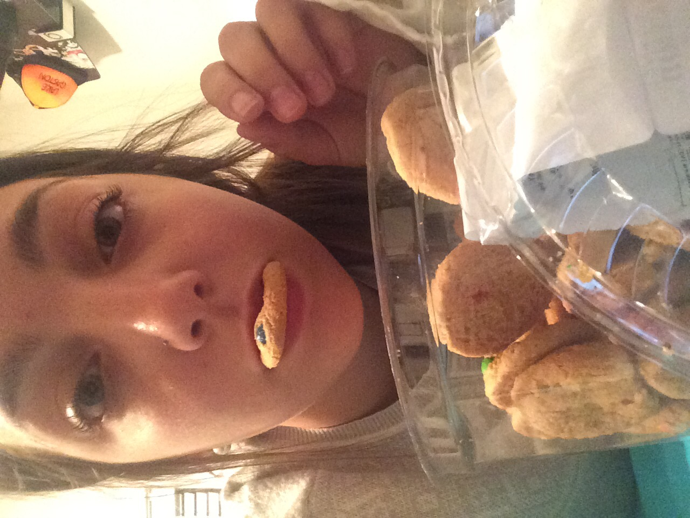

```{r setup, include=FALSE}
knitr::opts_chunk$set(echo = TRUE)
```

**Hiking**

```{r, echo=FALSE}
knitr::include_graphics("./images/IMG_7575.JPG")
```

**Snowboarding**

```{r, echo=FALSE}
knitr::include_graphics("./images/IMG_0206.JPG")
```

**Painting**

```{r, echo=FALSE}
knitr::include_graphics("./images/BOBBY.jpeg")
```

**Working Out**

```{r, echo=FALSE}

```