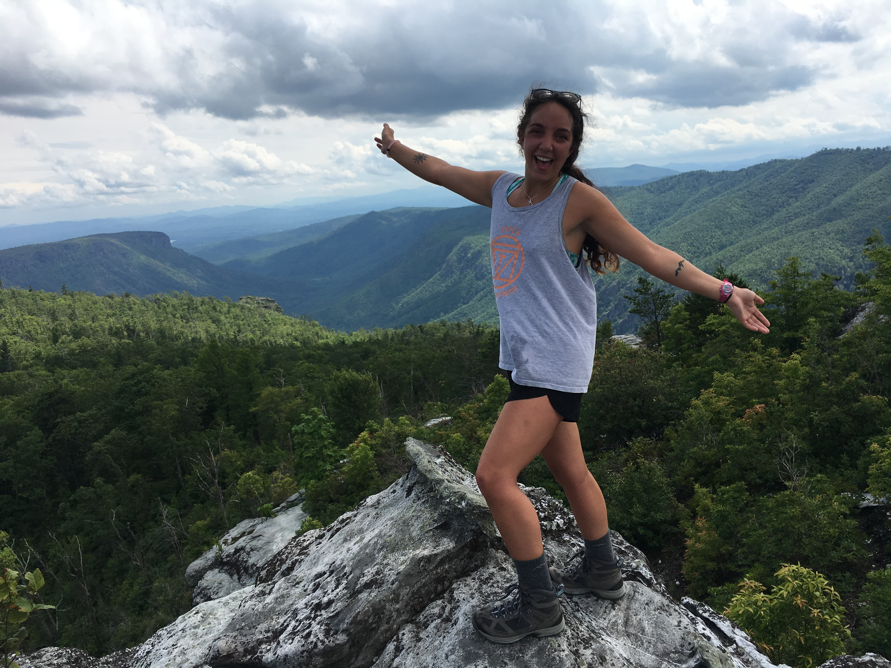
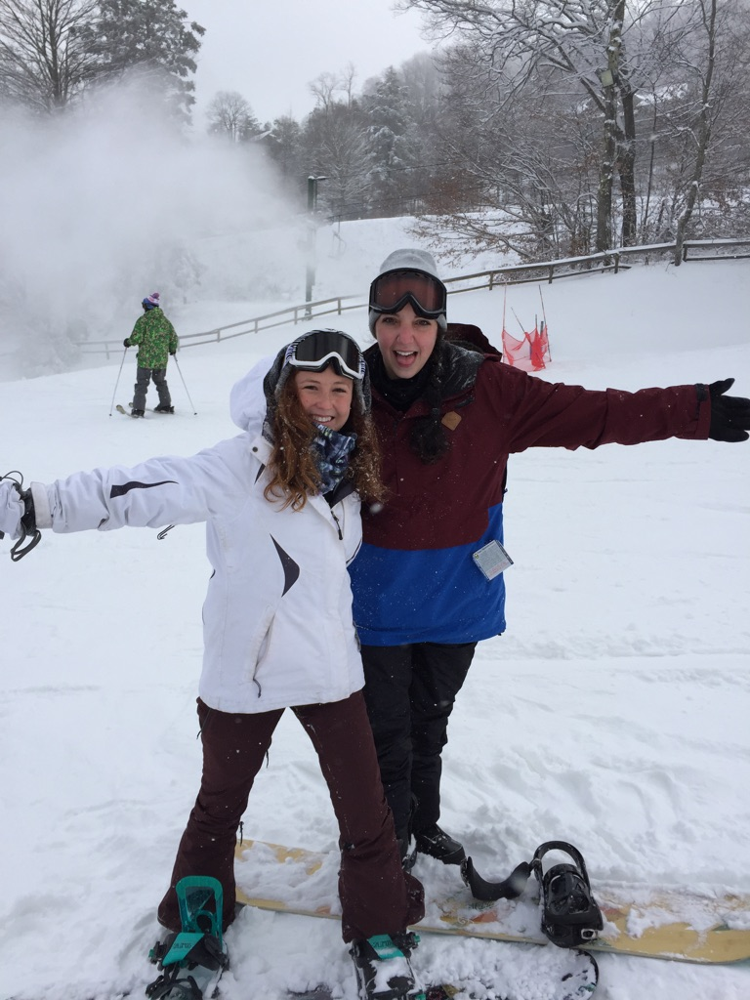
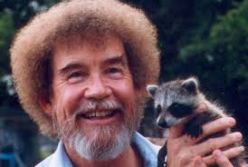
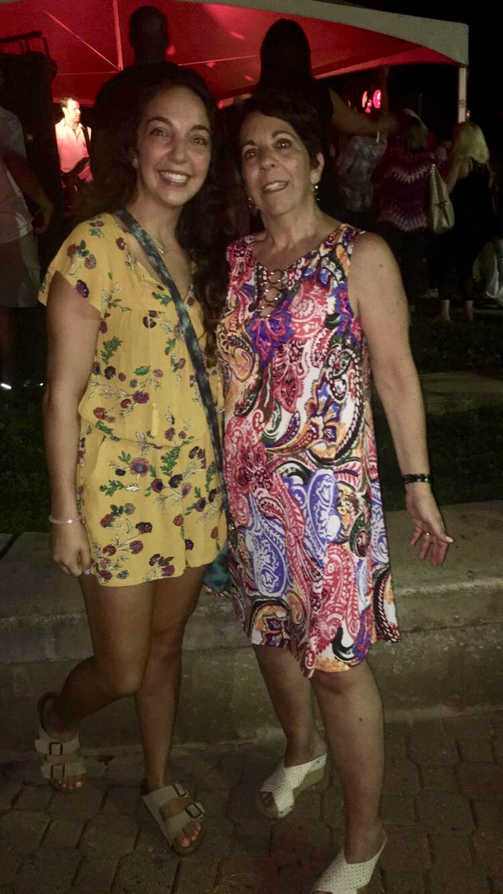

```{r setup, include=FALSE}
knitr::opts_chunk$set(echo = TRUE)
```


\


##Hiking

I love to go hiking! It allows me to get some exercise, fresh air, and to releive some stress. It's also very humbling indulging in nature. Most often I hit the Parkway or Linville Gorge.

```{r, echo=FALSE}

```

\


##Snowboarding

I began snowboarding my freshman year when I took the class as one of my P.E. credits. I fell in love with it and got a board for my birthday the next year. Now, I spend a lot of my free-time in the winter with my friends on the slopes! Typically, App. Ski Mtn. or Sugar Mtn. 

```{r, echo=FALSE}

```

\


##Art

I've never really taken any interest in art in the educational setting, mostly because I'm not all that good. However, I love to paint leisurely. I often have blank canvases just waiting to be painted when the inspiration strikes. 

```{r, echo=FALSE}

```


\


##Music

I think more than anything, I love love LOVE music and everything to do with it. I listen to all kinds of genres, tempos, bands, artists, etc. I spend a lot of my time perfecting my Spotify playlists and browsing for new music I've never heard. I also try to go to as many concerts as I can! Live music cures the soul. 

```{r, echo=FALSE}

```